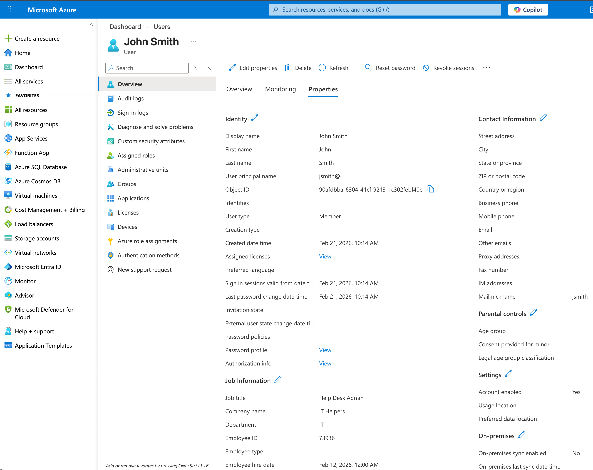
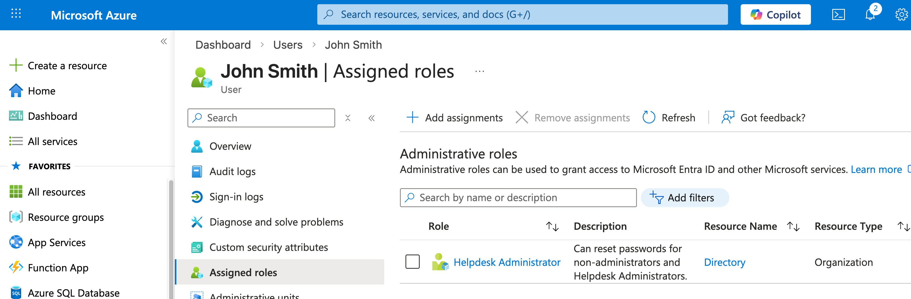
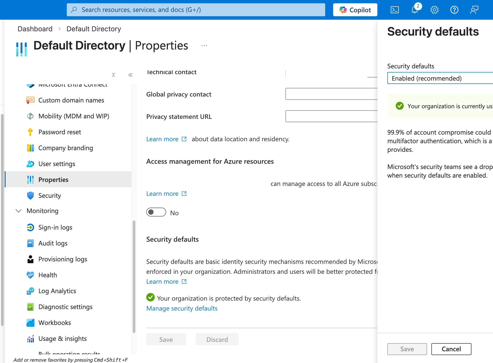
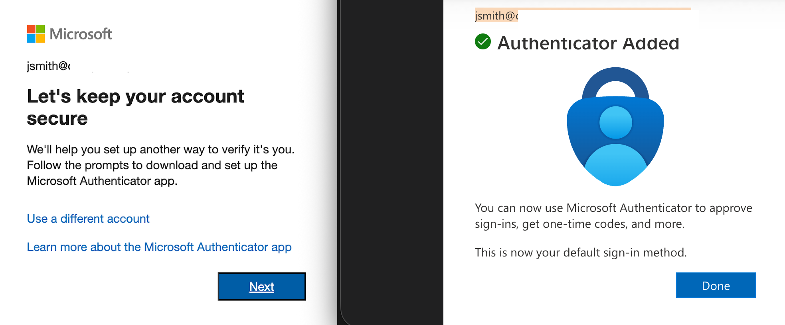
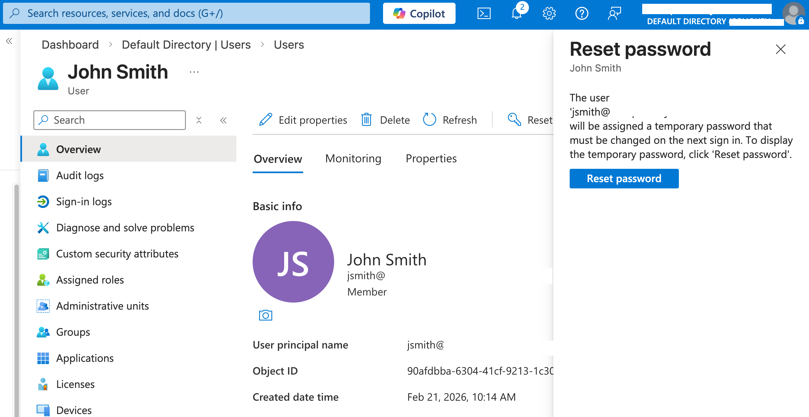
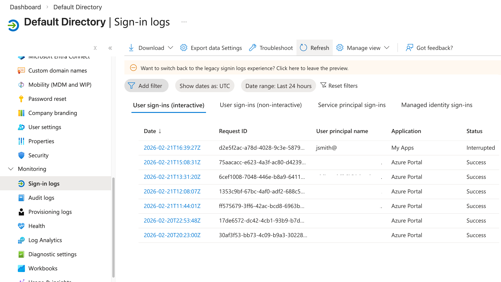
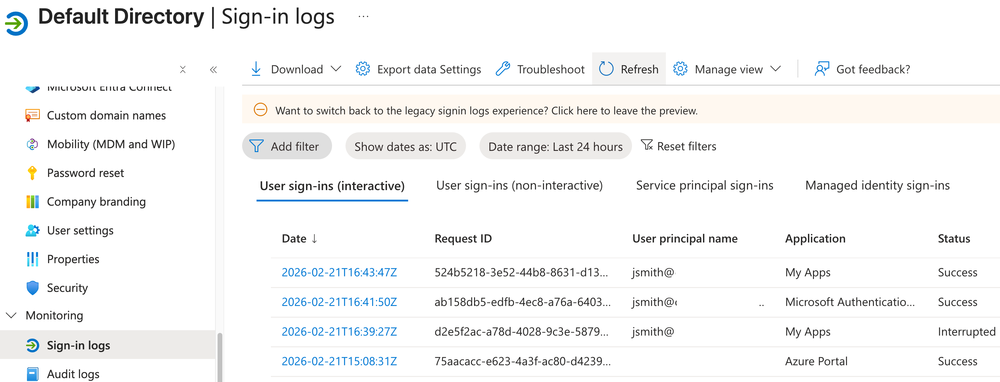
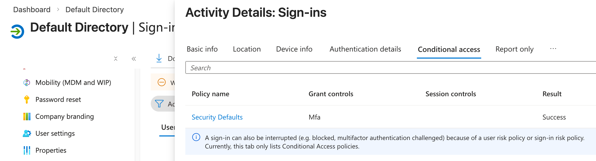
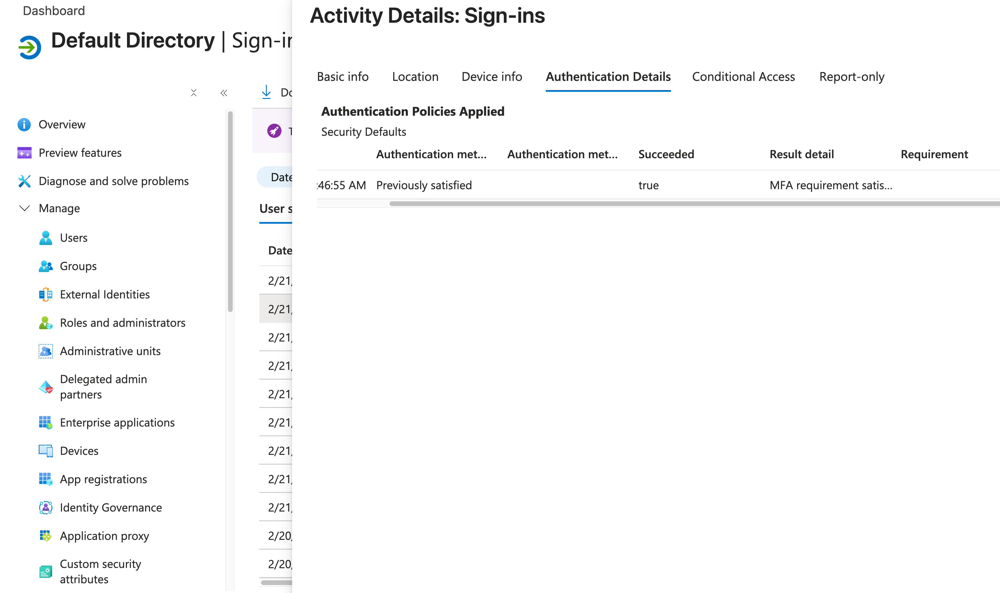

# Microsoft Entra ID – Identity & Access Management Lab

## Objective
Simulate a cloud identity management environment using Microsoft Entra ID to perform 
common user administration, MFA enforcement, and sign-in log analysis tasks 
representative of a real-world Tier 1 Help Desk environment.

## Tools & Technologies Used
- Microsoft Azure (Free Student Subscription)
- Microsoft Entra ID (Azure Active Directory)
- Microsoft Authenticator App
- Azure Portal (GUI)

## Real-World Relevance
Nearly every modern organization uses Microsoft Entra ID as their cloud identity 
provider. Tier 1 Help Desk technicians regularly perform user account management, 
assist users with MFA setup, and read sign-in logs to troubleshoot authentication 
issues. This lab demonstrates hands-on proficiency with these core responsibilities.

---

## Part 1 — User Creation

### Objective
Create a new cloud user in Entra ID simulating the onboarding of a new employee.

### Steps Performed
- Navigated to Microsoft Entra ID → Users → New User
- Created user John Smith (jsmith@domain.onmicrosoft.com)
- Assigned job title and department to simulate a realistic employee profile
- Auto-generated temporary password and documented credentials securely

### Screenshot

### Real-World Relevance
User creation is one of the most common Tier 1 tasks. When a new employee joins 
an organization, the help desk is responsible for provisioning their account in 
Entra ID or Active Directory before they can access any company resources.

---

## Part 2 — Role Assignment (RBAC)

### Objective
Assign a role to the new user demonstrating Role Based Access Control (RBAC).

### Steps Performed
- Navigated to John Smith's user profile
- Assigned the Helpdesk Administrator role via Assigned Roles
- Verified role appeared under the user's profile

### Screenshot

### Real-World Relevance
RBAC ensures users only have the permissions they need — a core principle of 
least privilege access. In a real environment, assigning incorrect roles is a 
common issue Tier 1 techs troubleshoot when users report missing permissions.

---

## Part 3 — MFA Enforcement via Security Defaults

### Objective
Demonstrate MFA enforcement using Microsoft's baseline Security Defaults policy.

### What Are Security Defaults?
Security Defaults is Microsoft's built-in baseline Conditional Access policy 
available on all Entra ID tenants at no cost. It enforces MFA for all users 
via the Microsoft Authenticator app and blocks legacy authentication protocols. 
It functions as a Conditional Access policy under the hood, as evidenced by 
the sign-in logs shown in Part 5.

### Steps Performed
- Confirmed Security Defaults were enabled under Entra ID → Properties → 
  Manage Security Defaults
- Signed in as John Smith in an incognito browser window via myapps.microsoft.com
- Was immediately prompted to register MFA via Microsoft Authenticator
- Completed MFA registration on mobile device

### Screenshots

### Real-World Relevance
MFA setup assistance is one of the highest volume Tier 1 tickets in any 
organization. Understanding how Security Defaults enforces MFA and walking 
a user through the registration process is a daily help desk responsibility.

---

## Part 4 — Password Reset

### Objective
Demonstrate the password reset process for a user account.

### Steps Performed
- Navigated to John Smith's user profile in Entra ID
- Clicked Reset Password at the top of the profile
- Azure generated a temporary password
- Documented that the user would be prompted to create a new password on next login

### Screenshot

### Real-World Relevance
Password resets are the single most common Tier 1 help desk ticket in most 
organizations. This demonstrates the cloud equivalent of the same task performed 
in on-premises Active Directory.

---

## Part 5 — Sign-In Log Analysis

### Objective
Read and interpret Entra ID sign-in logs to understand authentication events 
and troubleshoot access issues — a core Tier 1 troubleshooting skill.

### Steps Performed
- Navigated to Entra ID → Monitoring → Sign-in Logs
- Located John Smith's sign-in entries
- Analyzed both an interrupted and a successful sign-in entry
- Reviewed the Conditional Access, Basic Info, and Authentication Details tabs

---

### 5a — Interrupted Sign-In

An interrupted status means the sign-in was initiated but not completed. 
In this case MFA registration had not yet been finished, causing Entra ID 
to intercept the login and halt the process until MFA was satisfied.

---

### 5b — Successful Sign-In

After completing MFA registration, John Smith's subsequent login shows 
a Success status confirming full authentication was achieved.

---

### 5c — Conditional Access & Grant Controls

The Conditional Access tab confirms that Security Defaults applied its 
baseline MFA policy to this sign-in. The Grant Controls section shows 
that MFA was the enforced requirement and access was only granted after 
the MFA condition was satisfied. This demonstrates that even without a 
paid Entra ID P1 license, Conditional Access policies are actively 
enforced and visible in the logs.

---

### 5d — Authentication Details Tab

The Authentication Details tab shows the full step-by-step authentication 
chain including:
- Authentication method used
- Whether MFA was freshly completed or previously satisfied via session token
- Final result: Succeeded — True

"Previously satisfied" indicates the MFA claim was carried over from a 
prior authenticated session token, which is normal behavior in Microsoft's 
authentication flow. This prevents unnecessary repeated MFA prompts for 
users who have already verified their identity in the same session.

---

### Real-World Relevance
Reading sign-in logs is one of the most important Tier 1 troubleshooting 
skills. When a user reports they cannot log in, a Tier 1 tech navigates 
to sign-in logs to identify whether the failure was due to a wrong password, 
MFA issue, Conditional Access policy block, or account status problem. 
Understanding the difference between interrupted, failed, and success 
statuses allows for faster and more accurate ticket resolution and escalation.

---

## Summary of Skills Demonstrated

| Skill | Tool Used |
|---|---|
| Cloud user provisioning | Microsoft Entra ID |
| Role Based Access Control (RBAC) | Microsoft Entra ID |
| MFA enforcement and registration | Security Defaults / Authenticator |
| Password reset | Entra ID Admin Portal |
| Sign-in log analysis | Entra ID Monitoring |
| Conditional Access policy interpretation | Entra ID Sign-in Logs |
| Authentication chain analysis | Authentication Details Tab |

---

## Notes
This lab was performed using a Microsoft Azure Student subscription. 
Entra ID P1 features such as custom Conditional Access policies were not 
available under this subscription tier. Security Defaults was used as the 
baseline MFA and Conditional Access equivalent, which is consistent with 
how many small to mid-size organizations configure their Microsoft tenants.